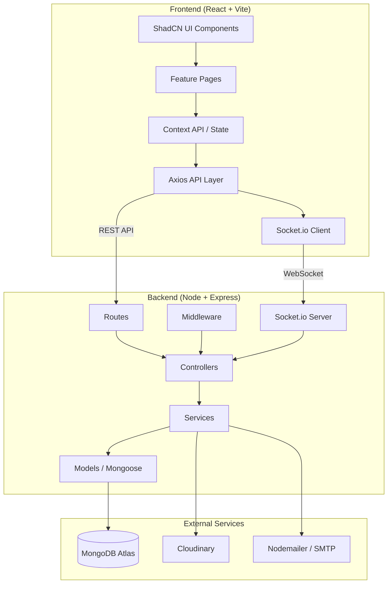

# CareSync — Patient Management System

A production-ready, enterprise-grade Patient Management System built with the MERN stack, featuring role-based access control, real-time notifications, analytics dashboards, and a premium healthcare UI.

## Project Overview

**Workspace**: `c:\Users\Harshil Thakkar\OneDrive\Desktop\Caresync\CareSync`

The project will be structured as a **monorepo** with separate `server/` and `client/` directories sharing a root `package.json` for concurrent dev scripts.

---

## User Review Required

> [!IMPORTANT]
> **MongoDB Atlas**: You'll need to provide your MongoDB Atlas connection string. I'll create a `.env.example` template. Do you already have a MongoDB Atlas cluster set up?

> [!IMPORTANT]
> **Cloudinary**: File uploads require a Cloudinary account. Do you have Cloudinary credentials (cloud name, API key, API secret)?

> [!IMPORTANT]
> **Email (Nodemailer)**: For email notifications, you'll need SMTP credentials (e.g., Gmail app password or a service like SendGrid). What email service do you plan to use?

> [!WARNING]
> **Scope & Phasing**: This is an enterprise-scale application with 50+ pages/components, 8 database models, 40+ API endpoints, real-time WebSockets, PDF generation, email integration, and analytics. I'll build this in **8 phases** and deliver a **fully functional, production-ready** system. Each phase builds on the previous. The total codebase will be ~15,000+ lines of code.

## Open Questions

1. **TypeScript vs JavaScript**: The modern standard is TypeScript. Shall I use TypeScript for both frontend and backend, or stick with JavaScript?
2. **Tailwind CSS Version**: ShadCN UI works best with Tailwind CSS v4 (latest). Should I use v4, or do you prefer v3?
3. **Billing Currency**: What currency should the billing module use? (USD, INR, EUR, etc.)
4. **Color Theme**: Do you have a preferred primary color for the healthcare theme? I'll default to a medical teal/blue palette if not specified.

---

## Architecture Overview



---

## Folder Structure

```
CareSync/
├── client/                          # React + Vite frontend
│   ├── public/
│   │   └── favicon.svg
│   ├── src/
│   │   ├── assets/                  # Static assets (images, icons)
│   │   ├── components/
│   │   │   ├── ui/                  # ShadCN UI components
│   │   │   ├── layout/              # Sidebar, Navbar, Layout wrappers
│   │   │   ├── common/              # Shared components (DataTable, Modal, etc.)
│   │   │   └── charts/              # Recharts wrapper components
│   │   ├── features/
│   │   │   ├── auth/                # Login, Register, ForgotPassword
│   │   │   ├── dashboard/           # Admin, Doctor, Patient dashboards
│   │   │   ├── patients/            # Patient CRUD, profile, history
│   │   │   ├── appointments/        # Booking, calendar, management
│   │   │   ├── prescriptions/       # Create, view, PDF generation
│   │   │   ├── billing/             # Invoices, payments
│   │   │   ├── doctors/             # Doctor management
│   │   │   ├── departments/         # Department management
│   │   │   ├── notifications/       # Notification center
│   │   │   └── settings/            # Profile, preferences
│   │   ├── hooks/                   # Custom hooks (useAuth, useSocket, etc.)
│   │   ├── context/                 # AuthContext, ThemeContext, SocketContext
│   │   ├── services/                # API service layer (Axios instances)
│   │   ├── lib/                     # Utility functions, constants
│   │   ├── App.jsx
│   │   ├── main.jsx
│   │   └── index.css                # Tailwind + global styles
│   ├── components.json              # ShadCN config
│   ├── vite.config.js
│   ├── tailwind.config.js
│   └── package.json
│
├── server/                          # Node + Express backend
│   ├── src/
│   │   ├── config/
│   │   │   ├── db.js                # MongoDB connection
│   │   │   ├── cloudinary.js        # Cloudinary config
│   │   │   └── email.js             # Nodemailer transporter
│   │   ├── controllers/
│   │   │   ├── authController.js
│   │   │   ├── patientController.js
│   │   │   ├── appointmentController.js
│   │   │   ├── prescriptionController.js
│   │   │   ├── doctorController.js
│   │   │   ├── departmentController.js
│   │   │   ├── billingController.js
│   │   │   ├── notificationController.js
│   │   │   └── dashboardController.js
│   │   ├── middleware/
│   │   │   ├── auth.js              # JWT verification
│   │   │   ├── roleAuth.js          # Role-based authorization
│   │   │   ├── errorHandler.js      # Global error handler
│   │   │   ├── validate.js          # Input validation (Joi)
│   │   │   ├── upload.js            # Multer file upload
│   │   │   └── rateLimiter.js       # API rate limiting
│   │   ├── models/
│   │   │   ├── User.js
│   │   │   ├── Patient.js
│   │   │   ├── Doctor.js
│   │   │   ├── Appointment.js
│   │   │   ├── Prescription.js
│   │   │   ├── Department.js
│   │   │   ├── Bill.js
│   │   │   └── Notification.js
│   │   ├── routes/
│   │   │   ├── authRoutes.js
│   │   │   ├── patientRoutes.js
│   │   │   ├── appointmentRoutes.js
│   │   │   ├── prescriptionRoutes.js
│   │   │   ├── doctorRoutes.js
│   │   │   ├── departmentRoutes.js
│   │   │   ├── billingRoutes.js
│   │   │   ├── notificationRoutes.js
│   │   │   └── dashboardRoutes.js
│   │   ├── services/
│   │   │   ├── authService.js
│   │   │   ├── emailService.js
│   │   │   ├── appointmentService.js
│   │   │   ├── prescriptionService.js
│   │   │   └── cloudinaryService.js
│   │   ├── utils/
│   │   │   ├── generateToken.js
│   │   │   ├── generateId.js
│   │   │   ├── apiResponse.js
│   │   │   ├── asyncHandler.js
│   │   │   └── pdfGenerator.js
│   │   ├── socket/
│   │   │   └── socketHandler.js     # Socket.io event handlers
│   │   ├── seeders/
│   │   │   └── seed.js              # Dummy data seeder
│   │   └── server.js                # App entry point
│   ├── .env.example
│   └── package.json
│
├── .gitignore
├── package.json                     # Root: concurrently scripts
└── README.md
```

---

## Proposed Changes — Phased Implementation

### Phase 1: Project Scaffolding & Configuration

Set up both projects, install all dependencies, configure Tailwind + ShadCN, and establish the dev workflow.

#### [NEW] Root package.json
- Concurrently scripts to run client + server together
- `npm run dev` starts both

#### [NEW] server/package.json & server entry
- Express server with middleware stack (helmet, cors, morgan, rate-limiter, compression)
- MongoDB connection via Mongoose
- Socket.io initialization
- Environment variable loading

#### [NEW] client/ (Vite + React)
- Scaffold with `npm create vite@latest`
- Install & configure Tailwind CSS
- Initialize ShadCN UI
- Set up path aliases (`@/`)
- Configure proxy for API calls

---

### Phase 2: Database Models & Backend Core

#### [NEW] server/src/models/ (8 models)

| Model | Key Fields | Relations |
|-------|-----------|-----------|
| **User** | name, email, password, role, avatar, isActive, resetToken | — |
| **Patient** | patientId (auto), userId, dob, gender, blood group, address, emergencyContact, allergies, chronicDiseases, documents[] | → User |
| **Doctor** | userId, specialization, qualification, experience, department, availability[], fee, status | → User, → Department |
| **Appointment** | appointmentId, patient, doctor, date, timeSlot, status, type, notes, queueNumber | → Patient, → Doctor |
| **Prescription** | prescriptionId, appointment, patient, doctor, diagnosis, medicines[], instructions, followUpDate | → Appointment, → Patient, → Doctor |
| **Department** | name, description, head, status | → Doctor |
| **Bill** | billId, patient, appointment, items[], totalAmount, discount, tax, paidAmount, status, paymentMethod | → Patient, → Appointment |
| **Notification** | user, title, message, type, isRead, link | → User |

#### [NEW] server/src/middleware/
- `auth.js` — JWT token verification, attaches `req.user`
- `roleAuth.js` — Role-based access control (`authorize('admin', 'doctor')`)
- `errorHandler.js` — Centralized error handling with custom `AppError` class
- `validate.js` — Joi schema validation middleware
- `upload.js` — Multer memory storage for Cloudinary
- `rateLimiter.js` — express-rate-limit configuration

#### [NEW] server/src/utils/
- `generateToken.js` — JWT sign/verify helpers
- `generateId.js` — Sequential ID generator (PAT-0001, APT-0001, etc.)
- `apiResponse.js` — Standardized response format
- `asyncHandler.js` — Async error wrapper for controllers

#### [NEW] server/src/config/
- `db.js` — Mongoose connection with retry logic
- `cloudinary.js` — Cloudinary SDK config
- `email.js` — Nodemailer transporter setup

---

### Phase 3: Authentication System

#### [NEW] server/src/controllers/authController.js
- `POST /api/auth/register` — Register user (with role)
- `POST /api/auth/login` — Login, return JWT + refresh token
- `POST /api/auth/logout` — Invalidate token
- `POST /api/auth/forgot-password` — Send reset email
- `POST /api/auth/reset-password/:token` — Reset password
- `GET /api/auth/me` — Get current user profile
- `PUT /api/auth/profile` — Update profile
- `PUT /api/auth/change-password` — Change password

#### [NEW] client/src/features/auth/
- `LoginPage.jsx` — Email/password login with validation
- `RegisterPage.jsx` — Multi-step registration
- `ForgotPasswordPage.jsx` — Email input for reset
- `ResetPasswordPage.jsx` — New password form

#### [NEW] client/src/context/AuthContext.jsx
- Authentication state management
- Login/logout/register actions
- Token persistence in localStorage
- Auto-refresh on app load

---

### Phase 4: Layout & Navigation

#### [NEW] client/src/components/layout/
- `DashboardLayout.jsx` — Main layout with sidebar + topbar
- `Sidebar.jsx` — Collapsible sidebar with role-based menu items
- `TopNavbar.jsx` — Search, notifications, user menu, dark mode toggle
- `MobileNav.jsx` — Responsive mobile navigation

#### [NEW] client/src/context/ThemeContext.jsx
- Dark/light mode toggle with localStorage persistence

#### [NEW] client/src/components/common/
- `DataTable.jsx` — Reusable sortable/filterable/paginated table
- `StatsCard.jsx` — Dashboard stat card with icon and trend
- `ConfirmDialog.jsx` — Confirmation modal
- `LoadingSkeleton.jsx` — Skeleton loading states
- `EmptyState.jsx` — Empty data placeholder
- `Badge.jsx` — Status badges (appointment status, role, etc.)
- `SearchFilter.jsx` — Search + filter bar component

---

### Phase 5: Core Feature Modules

#### Patient Management
- **Backend**: Full CRUD endpoints for patients, search/filter/paginate, document upload
- **Frontend**: Patient list page, patient profile page, add/edit patient forms, medical history view

#### Appointment Management
- **Backend**: CRUD + status management, availability checking, time slot validation, queue system
- **Frontend**: Appointment booking form, appointment calendar (day/week view), appointment list, doctor availability selector

#### Doctor Management
- **Backend**: CRUD for doctors, availability management, department assignment
- **Frontend**: Doctor list, doctor profile, availability schedule editor

#### Department Management
- **Backend**: CRUD for departments
- **Frontend**: Department list, add/edit department forms

---

### Phase 6: Prescriptions & Billing

#### Prescription Module
- **Backend**: Create/read prescriptions, link to appointments, generate PDF
- **Frontend**: Prescription form (medicines, dosage, instructions), prescription view/print, prescription history
- **PDF**: Use `pdfkit` or `html-pdf` for server-side PDF generation

#### Billing Module
- **Backend**: Create/manage bills, payment tracking, revenue calculations
- **Frontend**: Invoice creation, billing list, payment status, billing history

---

### Phase 7: Dashboards & Analytics

#### Admin Dashboard
- Total patients, doctors, appointments, revenue cards
- Appointment trend chart (Recharts AreaChart)
- Revenue chart (Recharts BarChart)
- Department distribution (PieChart)
- Recent appointments table
- Monthly growth stats

#### Doctor Dashboard
- Today's appointments list
- Patient queue
- Quick actions (add diagnosis, write prescription)
- Weekly schedule overview

#### Patient Dashboard (Portal)
- Upcoming appointments
- Recent prescriptions
- Billing summary
- Quick book appointment

---

### Phase 8: Notifications, Real-time & Polish

#### Socket.io Integration
- **Backend**: `server/src/socket/socketHandler.js` — Handle connection, join rooms by userId, emit events
- **Frontend**: `client/src/context/SocketContext.jsx` — Socket connection management
- Real-time events: new appointment, status change, new prescription, new bill

#### Notification System
- **Backend**: CRUD for notifications, mark as read, mark all read
- **Frontend**: Notification bell with unread count, notification dropdown, notification center page

#### Email Notifications
- Appointment confirmation email
- Appointment reminder
- Password reset email
- Welcome email on registration

#### Final Polish
- Landing page with hero, features, testimonials
- Loading skeletons everywhere
- Toast notifications (Sonner via ShadCN)
- Form validation with React Hook Form + Zod
- Error boundaries
- Lazy loading for all routes
- SEO meta tags
- README.md with full setup instructions
- Sample data seeder
- API documentation

---

## Database Schema Details

### User Schema
```javascript
{
  name: { type: String, required: true },
  email: { type: String, required: true, unique: true, lowercase: true },
  password: { type: String, required: true, select: false },
  role: { type: String, enum: ['admin', 'doctor', 'receptionist', 'patient'], default: 'patient' },
  phone: String,
  avatar: String,
  isActive: { type: Boolean, default: true },
  resetPasswordToken: String,
  resetPasswordExpire: Date,
  lastLogin: Date,
  timestamps: true
}
// Indexes: email (unique), role
```

### Patient Schema
```javascript
{
  patientId: { type: String, unique: true },  // PAT-0001
  user: { type: ObjectId, ref: 'User', required: true },
  dateOfBirth: Date,
  gender: { type: String, enum: ['male', 'female', 'other'] },
  bloodGroup: { type: String, enum: ['A+', 'A-', 'B+', 'B-', 'AB+', 'AB-', 'O+', 'O-'] },
  address: { street: String, city: String, state: String, zip: String },
  emergencyContact: { name: String, relation: String, phone: String },
  allergies: [String],
  chronicDiseases: [String],
  medicalHistory: [{ condition: String, diagnosedDate: Date, notes: String }],
  documents: [{ name: String, url: String, type: String, uploadedAt: Date }],
  insuranceInfo: { provider: String, policyNumber: String, expiryDate: Date },
  timestamps: true
}
// Indexes: patientId (unique), user (unique)
```

### Appointment Schema
```javascript
{
  appointmentId: { type: String, unique: true },  // APT-0001
  patient: { type: ObjectId, ref: 'Patient', required: true },
  doctor: { type: ObjectId, ref: 'Doctor', required: true },
  date: { type: Date, required: true },
  timeSlot: { start: String, end: String },
  type: { type: String, enum: ['consultation', 'follow-up', 'emergency', 'routine'], default: 'consultation' },
  status: { type: String, enum: ['pending', 'confirmed', 'in-progress', 'completed', 'cancelled', 'no-show'], default: 'pending' },
  queueNumber: Number,
  reason: String,
  notes: String,
  cancelReason: String,
  timestamps: true
}
// Indexes: appointmentId, patient, doctor, date, status
```

### Prescription Schema
```javascript
{
  prescriptionId: { type: String, unique: true },  // RX-0001
  appointment: { type: ObjectId, ref: 'Appointment' },
  patient: { type: ObjectId, ref: 'Patient', required: true },
  doctor: { type: ObjectId, ref: 'Doctor', required: true },
  diagnosis: String,
  medicines: [{
    name: String, dosage: String, frequency: String,
    duration: String, instructions: String
  }],
  instructions: String,
  followUpDate: Date,
  vitals: { bp: String, pulse: String, temp: String, weight: String, height: String },
  timestamps: true
}
```

### Bill Schema
```javascript
{
  billId: { type: String, unique: true },  // BILL-0001
  patient: { type: ObjectId, ref: 'Patient', required: true },
  appointment: { type: ObjectId, ref: 'Appointment' },
  items: [{ description: String, quantity: Number, unitPrice: Number, total: Number }],
  subtotal: Number,
  tax: Number,
  discount: Number,
  totalAmount: Number,
  paidAmount: { type: Number, default: 0 },
  status: { type: String, enum: ['pending', 'partial', 'paid', 'overdue', 'cancelled'], default: 'pending' },
  paymentMethod: { type: String, enum: ['cash', 'card', 'insurance', 'online'] },
  dueDate: Date,
  timestamps: true
}
```

---

## Key API Routes Summary

| Method | Endpoint | Description | Access |
|--------|---------|-------------|--------|
| POST | `/api/auth/register` | Register user | Public |
| POST | `/api/auth/login` | Login | Public |
| POST | `/api/auth/forgot-password` | Send reset email | Public |
| POST | `/api/auth/reset-password/:token` | Reset password | Public |
| GET | `/api/auth/me` | Get profile | Authenticated |
| PUT | `/api/auth/profile` | Update profile | Authenticated |
| GET | `/api/patients` | List patients | Admin, Doctor, Receptionist |
| POST | `/api/patients` | Create patient | Admin, Receptionist |
| GET | `/api/patients/:id` | Get patient detail | Admin, Doctor, Receptionist, Own Patient |
| PUT | `/api/patients/:id` | Update patient | Admin, Receptionist, Own Patient |
| DELETE | `/api/patients/:id` | Delete patient | Admin |
| POST | `/api/patients/:id/documents` | Upload document | Admin, Receptionist, Own Patient |
| GET | `/api/appointments` | List appointments | Role-filtered |
| POST | `/api/appointments` | Book appointment | All authenticated |
| PUT | `/api/appointments/:id` | Update appointment | Admin, Doctor, Receptionist |
| PUT | `/api/appointments/:id/status` | Change status | Admin, Doctor |
| GET | `/api/appointments/slots` | Get available slots | All authenticated |
| GET | `/api/doctors` | List doctors | All authenticated |
| POST | `/api/doctors` | Add doctor | Admin |
| PUT | `/api/doctors/:id/availability` | Set availability | Admin, Own Doctor |
| GET | `/api/prescriptions` | List prescriptions | Role-filtered |
| POST | `/api/prescriptions` | Create prescription | Doctor |
| GET | `/api/prescriptions/:id/pdf` | Download PDF | Admin, Doctor, Own Patient |
| GET | `/api/bills` | List bills | Role-filtered |
| POST | `/api/bills` | Create bill | Admin, Receptionist |
| PUT | `/api/bills/:id/pay` | Record payment | Admin, Receptionist |
| GET | `/api/departments` | List departments | All authenticated |
| POST | `/api/departments` | Create department | Admin |
| GET | `/api/notifications` | Get notifications | Authenticated (own) |
| PUT | `/api/notifications/read-all` | Mark all read | Authenticated |
| GET | `/api/dashboard/admin` | Admin stats | Admin |
| GET | `/api/dashboard/doctor` | Doctor stats | Doctor |
| GET | `/api/dashboard/patient` | Patient stats | Patient |

---

## Tech Stack & Dependencies

### Server Dependencies
```
express, mongoose, bcryptjs, jsonwebtoken, cors, helmet, morgan,
compression, express-rate-limit, express-validator, joi,
multer, cloudinary, nodemailer, socket.io, pdfkit, dotenv, slugify
```

### Client Dependencies
```
react, react-dom, react-router-dom, axios, socket.io-client,
recharts, react-hook-form, @hookform/resolvers, zod,
date-fns, lucide-react, clsx, tailwind-merge, class-variance-authority,
@radix-ui/* (via shadcn), sonner (toast)
```

---

## Verification Plan

### Automated Tests
1. **Server startup**: Verify Express server starts and connects to MongoDB
2. **API testing**: Test all endpoints with sample data using the seeder
3. **Auth flow**: Register → Login → Access protected route → Logout
4. **Frontend build**: Verify `npm run build` completes without errors

### Browser Testing
1. Navigate through all pages across roles (Admin, Doctor, Patient)
2. Test responsive design at mobile/tablet/desktop breakpoints
3. Verify dark/light mode toggle
4. Test appointment booking flow end-to-end
5. Verify real-time notifications via Socket.io

### Manual Verification
- Visual review of all dashboards and pages
- Form validation and error handling checks
- PDF prescription download
- File upload via Cloudinary (requires credentials)
- Email sending (requires SMTP credentials)
